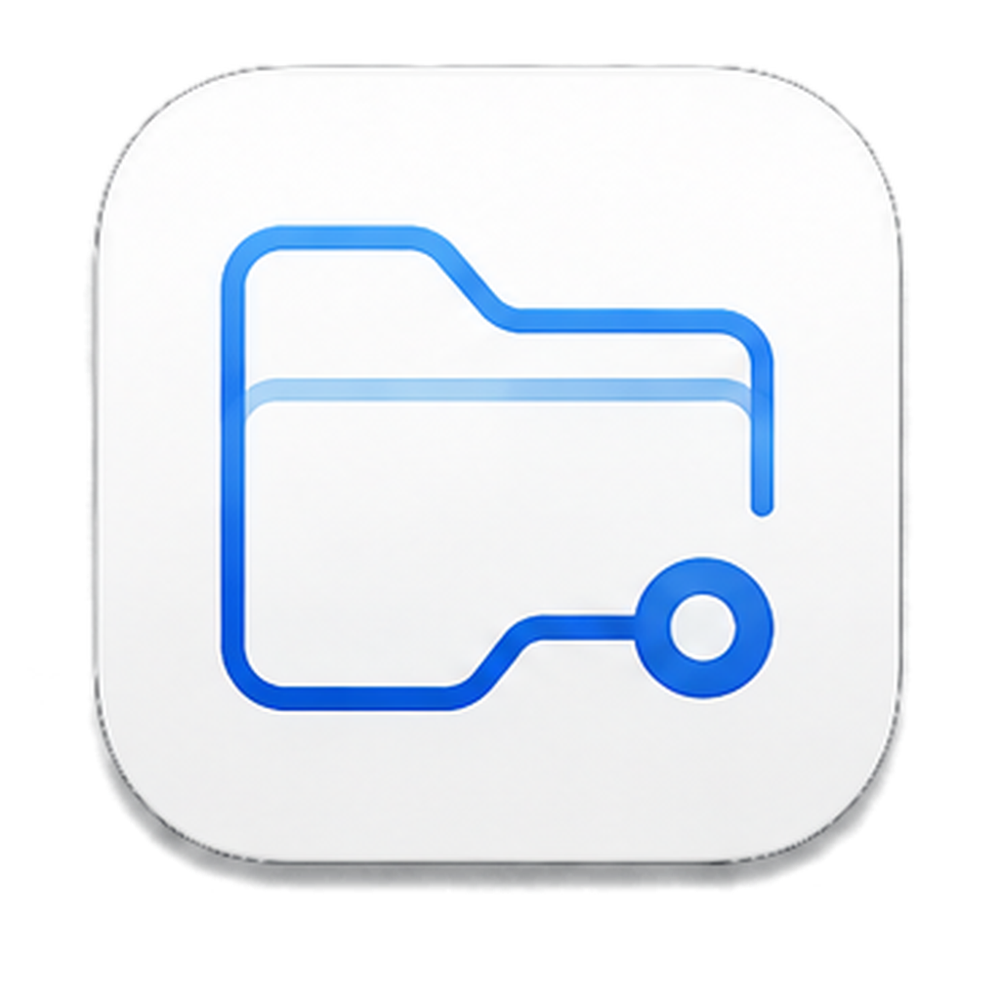
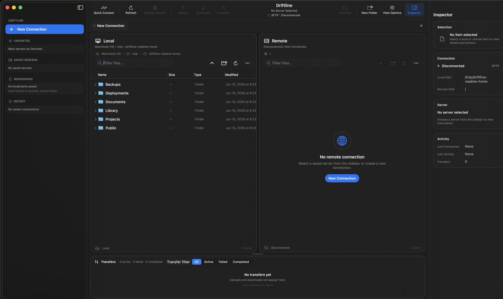

<div align="center">
<br />
<picture>
  <source media="(prefers-color-scheme: dark)" srcset="assets/app-icon-dark-1024.png">
  
</picture>
<h1>Driftline</h1>
<p><strong>Native macOS file transfer, calmly secure.</strong></p>
<p>
<a href="https://github.com/me-cedric/Driftline/actions/workflows/ci.yml"></a>
<a href="https://github.com/me-cedric/Driftline/releases/latest"></a>
<a href="LICENSE"></a>
<a href="https://swift.org"></a>
<a href="https://developer.apple.com/macos/"></a>
<a href="https://ko-fi.com/mecedric"></a>
</p>
<br />
</div>

<p align="center">
  
</p>

Driftline is a SwiftPM-first native macOS file transfer client. It combines a Finder-style dual-pane browser with secure SFTP transfers, Keychain-backed credentials, strict host trust, transfer history, and a zero-secret CLI.

Driftline is free and open source. If it helps you, you can [support development on Ko-fi](https://ko-fi.com/mecedric).

## Status

Driftline is active pre-1.0 software. SFTP workflows are functional and tested, but storage and APIs may still change before a stable 1.0 release.

| Area | Current state |
| --- | --- |
| System SSH/SFTP | Default backend. Uses system SSH tooling, strict host checks, and `rsync`/SCP transfers. |
| Native Swift SFTP | Opt-in backend. Supports password auth, Ed25519 keys, passphrase-protected Ed25519 keys, ECDSA PEM keys, browsing, file/folder transfers, cancellation, and large-file tests. |
| MCP server | Opt-in local AI integration over stdio or loopback HTTP. Off by default. |
| SCP | Fallback transfer backend. |
| FTP/FTPS/WebDAV/S3/SMB | Roadmap only. Not implemented or claimed secure yet. |
| Signing/notarization | Scripts and CI hooks exist, but public releases are unsigned until Apple credentials are configured. |

1.0 scope is frozen around secure SFTP. System SSH remains the default backend; Native Swift SFTP stays opt-in until broader real-server, accessibility, and security QA are complete. See [docs/release/1.0-scope.md](docs/release/1.0-scope.md).

## Features

### File Browsing

- Dual local/remote panes with native `NSOutlineView` rows and columns.
- Sorting, multi-select, disclosure expansion, hidden-file filtering, and metadata columns.
- Drag/drop and copy/paste transfers between panes.
- Local and remote create, rename, delete, copy path, reveal in Finder, and Get Info actions.
- Per-tab local/remote paths and listings.

### Transfers

- Upload/download files and folders.
- Transfer queue with progress, sorting, cancellation, retry, clearing, stats, and persisted history.
- Conflict handling with skip, overwrite, rename, and apply-to-remaining flows.
- Current-folder compare/sync preview for local-only, remote-only, and changed items.

### Security

- Credentials stored through `CredentialStore` and macOS Keychain.
- Passwords, passphrases, tokens, and private key material are never accepted as CLI arguments.
- Unknown hosts require explicit trust.
- Host fingerprint changes block by default.
- Logs and diagnostics pass through redaction.
- Delete and overwrite flows remain confirmation-driven.

### macOS Integration

- SwiftUI app shell with AppKit where native desktop controls matter.
- Sidebar for saved servers, favorites, bookmarks, and recent connections.
- Inspector, transfer panel, settings, About, update checks, and background notifications.
- `driftline` CLI for opening local paths, bookmarks, and new tabs.
- Optional MCP server for local AI tools, gated by Settings or CLI.

## Architecture

```
Driftline/
├── Sources/
│   ├── DriftlineApp/      # SwiftUI macOS app, commands, UI features
│   ├── DriftlineCore/     # UI-free domain, security, networking, persistence
│   ├── DriftlineMCP/      # UI-free MCP protocol, tools, sandbox, transports
│   ├── driftline-mcp/     # Standalone stdio MCP executable
│   └── driftline/         # CLI entry point
├── Tests/
│   └── DriftlineCoreTests/
├── docs/                  # Architecture, security, release, testing, UX docs
├── scripts/               # Build, test, lint, package, release helpers
└── assets/                # Icons and screenshots
```

Core boundaries:

- `DriftlineCore` stays UI-free and testable.
- Credentials live behind `CredentialStore`.
- Non-sensitive app data lives behind repository protocols.
- Remote browsing uses `RemoteFileSystemClient`.
- Transfers use `TransferClient`.
- SFTP/SSH implementation details do not leak into SwiftUI.

See [ARCHITECTURE.md](ARCHITECTURE.md) and [docs/architecture/](docs/architecture/).

## Install

Download the latest DMG from [GitHub Releases](https://github.com/me-cedric/Driftline/releases/latest).

Current public DMGs are unsigned/unnotarized. macOS may require manual approval in Privacy & Security until signing is configured.

## Build Locally

Requirements:

- macOS 14 or newer
- Xcode 15 or newer
- Swift 5.10 or newer

```bash
git clone https://github.com/me-cedric/Driftline.git
cd Driftline
./scripts/bootstrap.sh
swift build
swift test
./script/build_and_run.sh
```

Package a local DMG:

```bash
./scripts/package-dmg.sh
```

Artifacts are written to `dist/Driftline.dmg` and `dist/Driftline.dmg.sha256`.

## CLI

```bash
driftline .
driftline --open ~/Sites
driftline --bookmark staging
driftline --new-tab ~/Downloads
driftline --version
```

The CLI never accepts passwords, passphrases, tokens, or private key material.

MCP settings:

```bash
driftline mcp --status
driftline mcp --enable
driftline mcp --print-config
```

See [docs/architecture/mcp-server.md](docs/architecture/mcp-server.md).

## Testing

```bash
swift test
./scripts/lint.sh
./script/build_and_run.sh --verify
```

Run the Docker SFTP integration harness:

```bash
DRIFTLINE_TEST_PASSWORD='driftline-test-password' ./scripts/integration-sftp-server.sh start

DRIFTLINE_INTEGRATION_SFTP=1 \
DRIFTLINE_NATIVE_INTEGRATION_SFTP=1 \
DRIFTLINE_TEST_HOST=127.0.0.1 \
DRIFTLINE_TEST_PORT=22222 \
DRIFTLINE_TEST_USER=driftline \
DRIFTLINE_TEST_KEY="$PWD/.integration/ssh/id_ed25519" \
DRIFTLINE_TEST_PASSWORD='driftline-test-password' \
swift test
```

For real-host QA, see [docs/testing/real-server-qa-matrix.md](docs/testing/real-server-qa-matrix.md).

## Release Flow

Tag-driven CI releases are supported:

```bash
git tag -a v0.5.2 -m "Driftline 0.5.2"
git push origin v0.5.2
```

The Release workflow verifies the tagged commit is on `main`, runs lint/tests, builds the app bundle, packages the DMG, uploads the checksum, and creates the GitHub Release. Signing and notarization are skipped for tag releases until Apple credentials are configured.

Manual release dispatch still creates a draft release for review.

## Documentation Map

- [ARCHITECTURE.md](ARCHITECTURE.md): top-level architecture summary.
- [SECURITY.md](SECURITY.md): vulnerability reporting and security principles.
- [SUPPORT.md](SUPPORT.md): support and bug-report expectations.
- [ROADMAP.md](ROADMAP.md): near-term and future product direction.
- [CHANGELOG.md](CHANGELOG.md): release history.
- [docs/architecture/](docs/architecture/): deeper implementation notes.
- [docs/security/](docs/security/): threat model, host trust, Keychain handling.
- [docs/release/](docs/release/): release checklist and distribution notes.
- [docs/testing/](docs/testing/): manual QA, integration harness, real-server matrix.
- [docs/ux/](docs/ux/): navigation, accessibility, design system.
- [docs/security/privacy-review.md](docs/security/privacy-review.md): local-first privacy/security review for 1.0.

## License

MIT. See [LICENSE](LICENSE).

## Acknowledgements

Driftline takes inspiration from classic dual-pane file transfer clients and native macOS tools, with a stronger bias toward secure defaults and calm desktop behavior.
