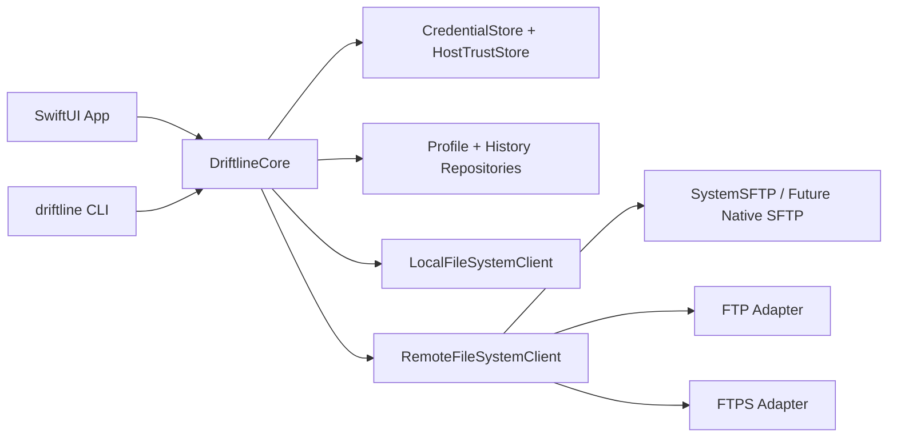

# Architecture Overview

Driftline separates domain, infrastructure, UI, and release concerns.

SwiftUI owns app presentation state. `DriftlineCore` owns behavior contracts and testable domain logic.

Performance considerations are tracked in [performance.md](performance.md).
